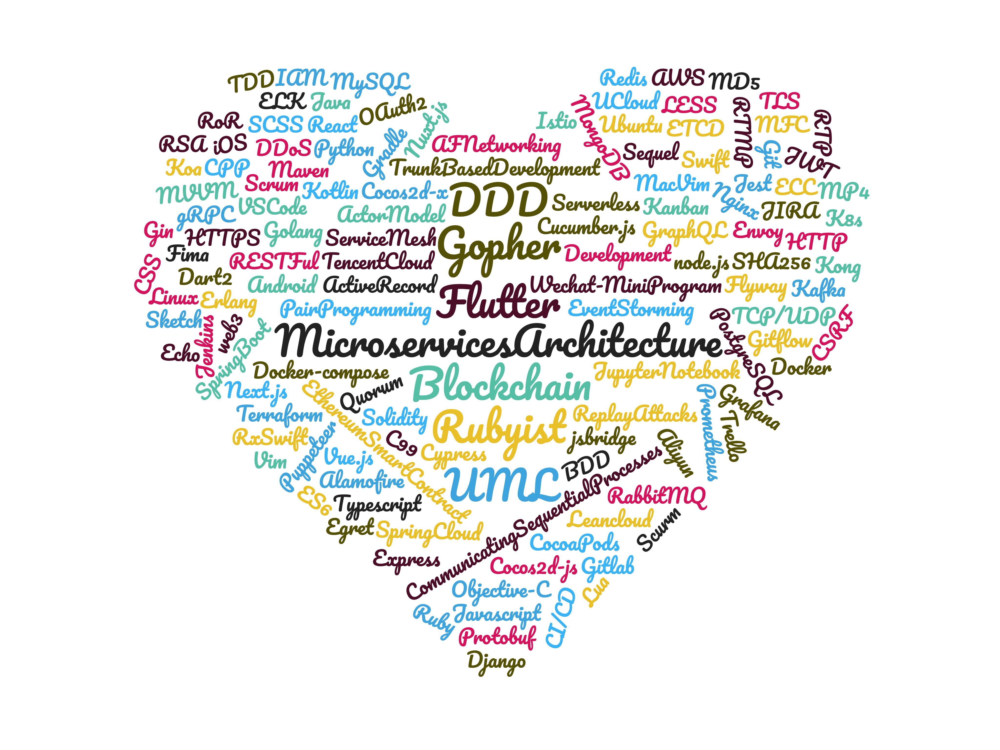

<!--
https://www.wordclouds.com/

Java, SpringBoot, SpringCloud, Golang, K8s, Kong, OAuth2, IAM, Javascript, ES6, Typescript, CSS, SCSS, SASS, LESS, React, Vue.js, Next.js, Nuxt.js, node.js, Ruby, Sequel, ActiveRecord, Ruby on Rails, Python2, Python3, Django, MySQL, PostgreSQL, Docker, Docker-compose, Gin, Echo, MongoDB, C99, MFC, Cpp, Cocos2d-x, Cocos2d-js, HTTP, RTMP, RTP, TS, TLS, MP4, HTTPS, CSRF, DDoS, Replay Attacks, Lua, jsbridge, Flutter, iOS, Android, Swift, Kotlin, Objective-C, Dart2, JWT, Wechat-MiniProgram, Erlang, Actor Model, CommunicatingSequentialProcesses, Jupyter Notebook,  flyway, Blockchain, Ethereum Smart Contract, RSA, ECC, MD5, SHA256, Base64, Egret, Sketch, Fima, Nginx, Linux, Ubuntu Server, AWS, Aliyun, Tencent Cloud, UCloud, Puppeteer, Cypress, Cucumber.js, TDD, BDD, Pair Programming, Trunk Development, Scurm, Kanban, XP, UML, Software Architecture, DDD, Event Storming, Microservices Architecture, CI/CD, Jenkins, Trello, JIRA, Git, Gitflow, Vim, MacVim, VS Code, web3, quorum, Protobuf, gRPC, RxSwift, Koa, Express, Redis, Kafka, RabbitMQ, CocoaPods, Gradle, Maven, Leancloud, Serverless, AFNetworking, Alamofire, ETCD, Istio, ELK, Prometheus, Grafana, Gitlab, Terraform, ServiceMesh, IaaS, PaaS, SaaS, CaaS, Envoy

-->

